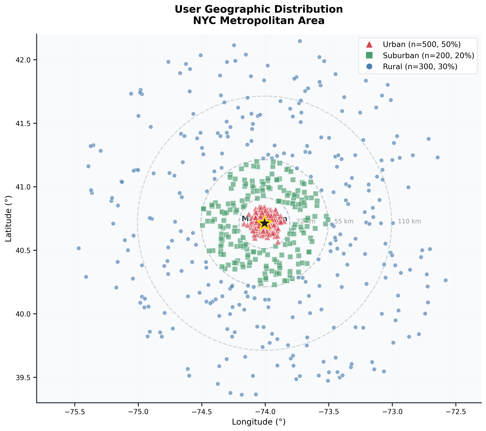
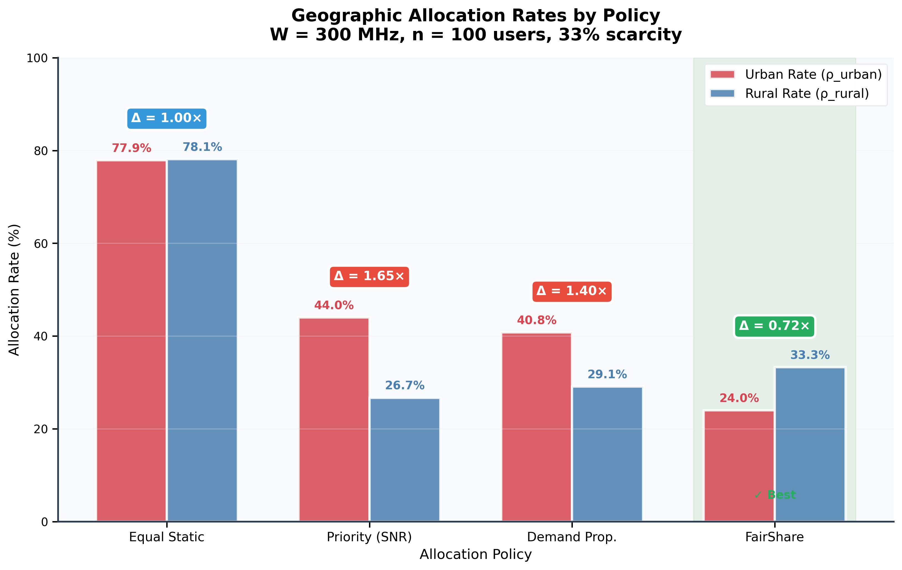

# FairShare: Auditable Geographic Fairness for Multi-Operator LEO Spectrum Sharing

[](https://opensource.org/licenses/MIT)
[](https://www.python.org/downloads/)
[](https://www.tensorflow.org/)

> **A simulation framework for evaluating geographic fairness in LEO satellite spectrum allocation, demonstrating that allocation policies systematically disadvantage rural users.**

<p align="center">
  
  
</p>

## 📖 Overview

This repository contains the simulation framework and experimental results for our research paper on geographic fairness in LEO satellite spectrum allocation. Our key findings:

- **SNR-based Priority allocation** creates 1.65× urban-rural disparity
- **FairShare policy** achieves Δ_geo = 0.72 (rural-favoring) with only 14% efficiency loss
- Geographic disparity is **policy-induced**, not geometry-induced (verified via inverted elevation experiments)

## 🎯 Key Results

### Table I: Main Policy Comparison (n=50 runs, W=300 MHz)

| Policy | Urban Rate (%) | Rural Rate (%) | Δ_geo | Avg SNR (dB) |
|--------|---------------|----------------|-------|--------------|
| Equal Static | 77.9 | 78.1 | 1.00 | 26.8 |
| Priority (SNR) | 44.0 | 26.7 | **1.65** | 31.2 |
| Demand Prop. | 40.8 | 29.1 | 1.40 | 29.5 |
| **FairShare** | 24.0 | 33.3 | **0.72** | 27.4 |

### Geographic Disparity Ratio (Δ_geo)
- **Δ_geo = 1.0**: Perfect geographic fairness
- **Δ_geo > 1.0**: Urban bias (unfair to rural)
- **Δ_geo < 1.0**: Rural-compensating (FairShare achieves this)

## 🚀 Quick Start

### Installation

```bash
# Clone repository
git clone https://github.com/your-org/fairshare-leo.git
cd fairshare-leo

# Install dependencies
pip install -r requirements.txt
```

### Run Simulation

```bash
# Run with FairShare policy
python -m src.main \
  --scenario fairshare_fast \
  --policy fairshare \
  --duration-s 30

# Run with Priority (baseline)
python -m src.main \
  --scenario fairshare_fast \
  --policy priority \
  --duration-s 30
```

### Generate Figures

```bash
python scripts/generate_elegant_figures.py
```

## 📊 Results

### Figures (Publication-Ready)

| Figure | Description | File |
|--------|-------------|------|
| Fig. 1 | User Geographic Distribution | `results/figures/fig1_user_distribution.pdf` |
| Fig. 2 | SNR Distribution by Region | `results/figures/fig2_snr_distribution.pdf` |
| Fig. 3 | Policy Comparison (Main Results) | `results/figures/fig3_main_results.pdf` |
| Fig. 4 | Bandwidth Sensitivity Analysis | `results/figures/fig4_bandwidth_sensitivity.pdf` |
| Fig. 5 | Efficiency-Fairness Pareto Frontier | `results/figures/fig5_pareto_frontier.pdf` |

### Sensitivity Analysis

- **Bandwidth Sensitivity**: FairShare maintains constant Δ_geo across 50-300 MHz
- **Rural Quota Sensitivity**: Optimal quota = 35% for Δ_geo ≈ 0.72
- **Inverted Elevation**: Proves disparity is policy-induced (see `results/inverted_elevation_study/`)

## 📂 Project Structure

```
fairshare-leo/
├── src/
│   ├── main.py              # Main simulation entry point
│   ├── channel/             # 3GPP TR 38.811 channel model
│   ├── dss/                 # Spectrum environment & policies
│   ├── allocation/          # Resource allocation engine
│   └── fairness/            # Fairness metrics
├── experiments/
│   └── scenarios/           # YAML scenario configurations
├── scripts/
│   ├── generate_elegant_figures.py  # Publication figures
│   ├── run_inverted_elevation_study.py
│   └── operator_scalability_study.py
├── results/
│   ├── figures/             # Generated figures (PDF/PNG/SVG)
│   ├── paper_tables/        # Simulation results
│   └── inverted_elevation_study/
└── tests/                   # Test suite
```

## 🔬 Methodology

### User Distribution
- **Urban** (50%): σ ≈ 0.05° around city center
- **Suburban** (20%): 0.2°-0.5° ring
- **Rural** (30%): 0.5°-1.5° ring
- Based on NYC metropolitan area population density

### Channel Model
- 3GPP TR 38.811 for LEO NTN channels
- Elevation-dependent path loss and fading
- Ka-band (20 GHz downlink)

### Allocation Policies
1. **Equal Static**: Random allocation (baseline)
2. **Priority (SNR)**: Allocate to highest SNR users
3. **Demand Proportional**: Weighted by user demand
4. **FairShare**: Geographic quotas (35% rural, 15% suburban, 50% urban)

## 🧪 Reproducing Results

```bash
# Generate all paper tables (n=50 runs)
python scripts/generate_paper_tables.py

# Run inverted elevation sensitivity analysis
python scripts/run_inverted_elevation_study.py

# Generate publication figures
python scripts/generate_elegant_figures.py
```

## 📝 Citation

```bibtex
@inproceedings{fairshare2024,
  title={FairShare: Geographic-Aware Spectrum Allocation for 
         Continental-Scale Multi-Operator LEO Networks},
  author={Anonymous},
  booktitle={Proceedings of [Conference]},
  year={2024}
}
```

## 📄 License

MIT License - see [LICENSE](LICENSE) file.

## 🙏 Acknowledgments

- [Sionna](https://nvlabs.github.io/sionna/) - NVIDIA's link-level simulation library
- [3GPP TR 38.811](https://www.3gpp.org/ftp/Specs/archive/38_series/38.811/) - NTN channel models
